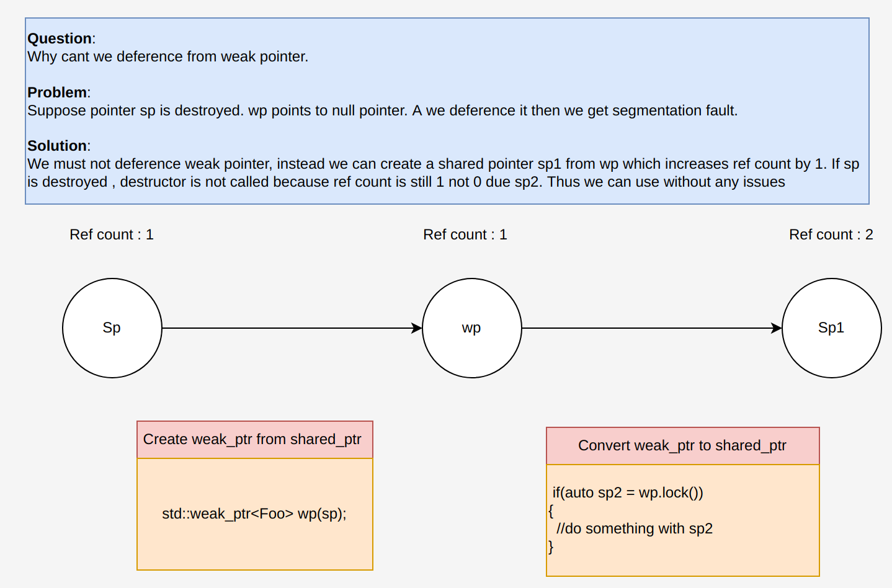

### Access Modifier

Member function and variables can be marked as following

- Private
- Protected
- Public

Private: 

- Data member: These are accessible only inside the class by class member function.
- Member function: These are accessible only inside the class by class member function.

Protected: 

- Data member: These are accessible inside the class and also in derived class
- Member function: These are accessible inside the class and also in derived class

Public: 

- Data member: These are accessible inside the class,derived class and outside the class
- Member function: These are accessible inside the class,derived class and outside the class

```c++
class A
{
	private:
        int a;
        void func1(){cout<<"func1"<<endl;}
    	void func11()
        {
            a = 11; 
            b = 21; 
            c = 31;
        }
	protected:
        int b;
        void func2()
        {
            cout<<"func2"<<endl;
        }
    	void func21()
        {
            a = 12; 
            b = 22; 
            c = 32;
        }
	public:
        int c;
        void func3()
        {
            cout<<"func3"<<endl;
        }
    	void func31()
        {
            a = 13; 
            b = 23; 
            c = 33;
        }
};

class B: public A
{
    private:
    	void func4()
        { 
        	a = 5; //error private member of class A
            b = 6; // ok protected member of class A is accessible
            c = 7; //ok public member of class A is accessible
        }
    protected:
    	void func5()
        {
        	a = 5; //error private member of class A
            b = 6; // ok protected member of class A is accessible
            c = 7; //ok public member of class A is accessible    
        }
    public:
    	void func6()
        {
            a = 5; //error private member of class A
            b = 6; // ok protected member of class A is accessible
            c = 7; //ok public member of class A is accessible
        }
}

int main()
{
    A objA;
    objA.a; 		//error: Private member are not accessible
    objA.func1(); 	//error: Private member are not accessible
    objA.func11(); 	//error: Private member are not accessible
    objA.func2(); 	//error: protected member are not accessible outside class A and B
    objA.func21(); 	//error: protected member are not accessible outside class A and B
    objA.func3(); 	//ok public member are accessible outside class
    objA.func31(); 	//ok public member are accessible outside class
        
}
```


### Static

#### Static Variables

In C++ static variable resides in RAM memory. Default value of static variable is 0. Scope of the static variable is within the translation unit. Life time of the variable is through the program. 

```c
int static_count()
{
	static int i; // Static variables are initialized only once. Later they are not reinitialized again
	i++;
	return i;
}

int simple_count()
{
	int i = 0; // local variables are initialized every call
	i++;
	return i;
}


int main()
{
cout<<simple_count()<<endl; // 1
cout<<simple_count()<<endl; // 1
cout<<simple_count()<<endl; // 1

cout<<static_count()<<endl; // 1
cout<<static_count()<<endl; // 2
cout<<static_count()<<endl; // 3
}
```


#### Static data member and member functions

Data members and member function of a marked static are shared by all instances of the class. These data members and member function can be accessed without any instantiating the class object.

##### Static data member

1. Declare the variable inside the class (This binds the static variable with class)
2. Define the variable outside the class (This is required as variable can be accessed without instantiating the class object)

So the rule to create static data member is **declare inside, define outside.**

const static data member  are static variable that are constant

```c++
class A
{
 public:
 	static int a; // declare static variable inside the class with static keyword
    const static int c; // declare constant static member
 	int b;
 public:
 	A():b(0){cout<<"Constructor for A"<<endl;};
 	~A(){cout<<"Destructor for A"<<endl;};
};

int A::a = 10;  // define static variable outside with data type and class scope resolution
const int A::c = 25; // define constant static member outside 

int main()
{
    // Access static variable without creating class object 
    cout<<"static variable before assigning new value: a : "<<A::a<<endl;
	A::a = 15;
    cout<<"static variable after assigning new value: a : "<<A::a<<endl;

    // Access static variable without creating class object 
    cout<<"static variable before assigning new value: c : "<<A::c<<endl;
	//A::c = 15; // error: Cannot modify constant static member
    
    //Access static variable using class object
    A obj1;
    A obj2;
    obj1.a = 20;
    cout<<"static variable: obj1.a : "<<obj1.a<<endl;
    
    // static variable is shared between all instances of the class
    cout<<"static variable: obj2.a : "<<obj2.a<<endl;
    return 0;
} 

--------------------------------------------------
Output
---------------------------------------------------
static variable before assigning new value: a : 10
static variable after assigning new value: a : 15
Constructor for A
Constructor for A
static variable: obj1.a : 20
static variable: obj2.a : 20
Destructor for A
Destructor for A

```


##### Static member function

Only static data member and NO non-static data member are allowed inside a static member function. This is because static member function can be called without instantiating the object for the class.


```c++
class A
{
 public:
 	static int a; // define inside
 	int b;
 public:
 	A():b(0){cout<<"Constructor for A"<<endl;};
 	~A(){cout<<"Destructor for A"<<endl;};
 	static int get_a(){return a;} //Add static keyword at the beginning of the function
 	static void set_a(int val){a = val;} //Add static keyword at the beginning of the function. Affect all class objects
};

int A::a = 0; // declare static variable outside with data type and class scope resolution

int main()
{
// Call static member function without creating class object
cout<<"static variable: a :"<<A::get_a()<<endl;
A::set_a(10);

// Call static member function with class object
A obj1;
cout<<"static variable: obj1.a :"<<obj1.get_a()<<endl;

return 0;
}

==========================================
Output
==========================================
static variable: a :0
Constructor for A
static variable: obj1.a :10
Destructor for A
```


#### Static class

A static class is a class containing static data member and static member function. Static class can NOT have any non-static data member or member function.

```c++
class A
{
	static int a;
public:
	static int get_a(){return a;}
	static void set_a(int val){a = val;}
};

int A::a = 10;

int main()
{
    cout<<"Before a = "<<A::get_a()<<endl;
    A::set_a(25);
    cout<<"After a = "<<A::get_a()<<endl;
    return 0;
}

=============================================
Output
=============================================
Before a = 10
After a = 25
```


### Casting

Why casting in C is not soo great.

In C we can cast any variable/struct to anything. Basically we group bytes in memory differently based on the cast. But its risky as we might make dangerous casts where grouped and interpreted meaning might change and compiler has no means to flag this. Resulting into logical bug hard to debug.

To provide some cast safety C++ provides following

1. const_cast<T> 
2. static_cast<T>
3. dynamic_cast<T>
4. reinterpret_cast<T>

#### Const_cast

##### const_cast (cast/strip away the constness)

Using *const_cast* a **non-const reference/pointer** can be used for **const data member or object**. In mentioned case const_cast helps to get rid of const-ness. Without const_cast a **non-const reference/pointer** cannot be used for **const data member or object**.

```c++
const int a{5};
int& b{a}; // error: A non const reference used for const variable. 
int& b = const_cast<int&>(a); // ok: using const_cast a non const reference can be used for const variable
int* c = const_cast<int*>(&a); // ok: using const_cast a non const pointer can be used for const variable
int d = const_cast<int>(a);  // error: invalid use of 'const_cast' with type 'int', which is not a pointer, reference, nor a 								//		   pointer-to-data-member type
```


##### Undefined behavior alert

Casting away constness of a object which is originally a const results into undefined behavior.

```c++
int main()
{
    const int a {5}; // a is a const int
    int& b = const_cast<int&>(a); // try to cast away the constness. Get a mutable reference to const a. Developer is responsible 									// for such hackery. (This can result undefined behavior)
    
    cout<<&b<<":"<<&a<<endl; // a and b have same address.  b is a reference of a
    b++;					// Increment value of b. remember originally a is const. But compiler does not complain here
    cout<<&b<<":"<<&a<<endl; // both a and b have same address, still b is a reference of a
    cout<<b<<":"<<a<<endl; // we expect either compiler error for modifying mem loc which was originally const or 										 // a to contain same value as b. But here is the undefined behaviour b is 6 and a is 5. 
}

output:
0x7ffc9bde6284:0x7ffc9bde6284
0x7ffc9bde6284:0x7ffc9bde6284
6:5
```

##### How to correct undefined behavior of const_cast on const object

Use volatile but still we are modifying defined constant member/object.

```c++
int main()
{
    volatile const int a {5}; 
    volatile int& b = const_cast<int&>(a); 
    
    cout<<&b<<":"<<&a<<endl; 
    b++;					
    cout<<&b<<":"<<&a<<endl; 
    cout<<b<<":"<<a<<endl; 										 
}
```


Const_cast is only used to **remove constness of object** which is **NOT orginally const**. But constness was acquired later.

```c++
int main()
{
    int a {5};  // originally a is non-const
    const int* b {&a};	// const value pointer to a (acquired constantness)
    (*b)++;  // error: this is invalid as b is const value pointer
    int& c = *b // error: binding reference of type 'int&' to 'const int' discards qualifiers
    int& c = const_cast<int&>(*b); // ok: remove constness of const value pointer b. (c is alias to a)
    int*& d = const_cast<int*&>(b); // ok: remove constness of const value pointer b. (d is alias to b)
    c++;			//ok: increment c
    cout<<a<<endl;  // 6
    cout<<*b<<endl; // 6
    cout<<c<<endl;  // 6

    (*d)++;			//ok: increment the value pointed by d
    cout<<a<<endl; // 7
    cout<<*b<<endl; // 7
    cout<<*d<<endl; // 7
    
    d++; // ok: d is not a const address pointer
}
```


#### static_cast

**static_cast** can be used to force implicit conversions.

Example for Implicit conversion 

- **non-const** object to **const**, 
- **int** to **double**, **int** to **float**, **float** to **int**
-  **void\*** pointers to **typed pointers**, 
- **base pointers** to **derived pointers**. (try to use dynamic cast even through it possible)

Note:

​	Cannot cast from **const** to **non-const** object. This can only be done by **const_cast** operator.

```c++
#include <iostream>
using namespace std;

class Base 
{   
    public: 
        int i = 5;
        void base_cls_func(){cout<<"Base class function"<<i<<endl;}
};
class Derived : public Base 
{ 
    public: 
        int j = 10;
        void derived_cls_func()
        {
            cout<<"Derived class function"<<j<<endl;
        }
};
class UnrelatedClass {};

int main() 
{

/**
Implicit conversion (smaller gets converted to larger automatically, in same type signed -> unsigned)
bool -> char -> short int -> unsigned short int -> int -> unsigned int -> long -> unsigned long -> long long -> float -> double -> long double
**/

 float a = 5.3;

 // typed pointer to void*  
 void* b = static_cast<void*>(&a);

 // void* to typed pointer
 float* c = static_cast<float*>(b);
 cout<<*c<<endl;


// float to int
 int d = static_cast<int>(a); 

// int to float
 float e = static_cast<float>(d); 
 cout<<e<<endl;


// typed pointer to typed pointer conversion are not allowed
float f = 5.9;
//int* g = static_cast<int*>(&f); // error :typed pointer to typed pointer not allowed


// Static cast in classes
Base bobj;
Derived dobj;

Base* bptr = static_cast<Base*>(&bobj); // ok
cout<<bptr->i<<endl;

Derived* dptr = static_cast<Derived*>(&dobj); // ok
cout<<dptr->i<<endl;
cout<<dptr->j<<endl;

// Implicit base class pointer pointing derived class object
Base* bptr2 = static_cast<Base*>(&dobj); // ok 
cout<<bptr2->i<<endl; // only base class member i is accessible using base class pointer
//cout<<bptr2->j<<endl; // c-error: derived class member j is not accessible using base class pointer

// Dont use static_cast here
Derived* dptr2 = static_cast<Derived*>(&bobj);
cout<<dptr2->i<<endl;
cout<<dptr2->j<<endl; // works but dangerous:  value is garbage as base class has no j member, 
                     // derived class pointer allows this 

// Cast base class pointer pointing derived class object to derived class pointer
Derived* dptr3 =  static_cast<Derived*>(bptr2);
cout<<dptr3->i<<endl; // derived class pointer can access i 
cout<<dptr3->j<<endl; // derived class pointer can access j

}
```


#### dynamic_cast

The need for **dynamic_cast** generally arises to perform **derived class operation on a derived class object**, **but  having only a pointer or reference-to-base**. That is a base class pointer or reference can point or refer to base class object or derived class object at run time. At compile time this information is not available (this is the reason static_cast cant be used here). Dynamic_cast uses RTTI (Run Time Type Information) check using **typeid()** to determine the type of the object pointed by the pointer and check if casting is possible.  

In short, **dynamic_cast is used to check at run-time if a downcast can be down correctly or not.** In case of upcast it either give compile error or returns nullptr or throws expection depending on polymorphic base class and pointer/reference explained later.


In c++ downcast is allowed by dynamic_cast, whereas upcast is not allowed by dynamic_cast. **Downcast**  is casting a derived class object to a base class pointer

```c++
class Base { };

class Derived : public Base { };

int main()
{
    Base b;
	Derived d;
    
    Base* pb1 = dynamic_cast<Base*>(&d); // ok: downcast: base class pointer pointing derived class object
	Base& rb1 = dynamic_cast<Base&>(d); // ok: downcast: base class reference refering to derived class object
}
```


Upcast using dynamic_cast gives compile time error if base class is not polymorphic. **Upcast** is casting a base class object to a derived class pointer. In short for dynamic_cast to work i**n case of downcast, it does not matter if base class is virtual or not**. But **in case of upcast, Base class must be virtual else it will give compile time error.**

```c++
class Base { };

class Derived : public Base { };
int main()
{
    Base b;
	Derived d;
    
    Derived* pd1 = dynamic_cast<Derived*>(&b); // compile error: upcasting. Base class must be polymorphic (virtual)
	Derived& rd1 = dynamic_cast<Derived&>(b); // compile error: upcasting. Base class must be polymorphic (virtual)
}

```


If base class is polymorphic an attempt to upcast results into return of nullptr. The compiler does not flag error in this case. 

```c++
class Base {virtual void vf(){}};

class Derived : public Base { };

int main() 
{
	Base b;
	Derived d;

	Base* pb = dynamic_cast<Base*>(&d);	// ok: downcast:Casting a derived class object to a base class pointer
	Derived* pd = dynamic_cast<Derived*>(&b); // ok:upcast: returns nullptr as casting may not be possible but not an error.
    Derived& rd = dynamic_cast<Derived&>(b); // expection:upcast:'std::bad_cast'

	return 0;
}
```


#### reinterpret_cast

reinterpret_cast is intended for **low-level casts that yield implementation-dependent** and it would not be portable. This cast is **used for reinterpreting a bit pattern**. It is **not guaranteed to be portable**. In fact, it is best to assume that reinterpret_cast is not portable at all.

**reinterpret_cast converts any pointer type to any other pointer type, even of  unrelated classes**. The operation result is a simple binary copy of the  value from one pointer to the other. **All pointer conversions are  allowed: neither the content pointed nor the pointer type itself is  checked**. So reinterpret_cast must be used carefully, **try not to use as much as possible**. 


```c++
#include <iostream>
using namespace std;

struct data {
	short low; 
	short high;
};

int main () {
	long value = 0xa234b567; //a234: high bytes, b567: low bytes
	struct data* pdata = reinterpret_cast<struct data*> (&value);
    cout << hex<<"High bytes 0x"<<pdata->high << endl;
	cout << hex<<"Low bytes 0x"<<pdata->low << endl;
	return 0;
}

--------------------------
Output
--------------------------
High bytes 0xa234
Low bytes 0xb567
```

##### Application of reinterpret_cast

Serialization/De-serialization

```c++
#include <iostream>
#include <string.h>

using namespace std;

// structure for sensor measurement
struct sensor_measurement {
    float speed; // 4 bytes
	float temperature; // 4 bytes
    double rotor_position; // 8 bytes
    int device_id; // 2 bytes
};

// virtual UART implementation
// Print data sending on console terminal
void uart_send(uint8_t* bytes, size_t count)
{
    cout<<"UART sending: ";
    for(auto i=0;i<count;i++)
    {
        cout<<hex<<"0x"<<bytes[i];
    }
    cout<<endl;
}

// serialize sensor measurement
uint8_t* serialize(struct sensor_measurement& data)
{
    // get measurement data size
    size_t buffer_size = sizeof(struct sensor_measurement);

    // create new buffer
    uint8_t* buffer = new uint8_t[buffer_size];
    if(buffer!=nullptr)
    {
        // copy sensor measurement to buffer
        memcpy(buffer, reinterpret_cast<uint8_t*>(&data),buffer_size);

        // send data via virtual UART
        uart_send(buffer,buffer_size);


        return buffer;
    }
    
    return nullptr;
}

// deserialize sensor measurement
struct sensor_measurement* deserialize(uint8_t* buffer)
{
    // Calculate size of the data based on measurement structure
    size_t buffer_size = sizeof(struct sensor_measurement);

    // create new buffer to copy data
    uint8_t* new_measure = new uint8_t[buffer_size];

    // copy data to new buffer
    if(new_measure != nullptr)
    {
        memcpy(new_measure, buffer,buffer_size);
        // cast to sensor_measurement structure from byte array
        struct sensor_measurement* sensor_data = reinterpret_cast<struct sensor_measurement*>(new_measure);
        return sensor_data;
    }
    return nullptr;
}

// print sensor measurement data
void print_sensor_measurement_data(struct sensor_measurement& data)
{
    cout<< "device_id: "<<data.device_id<<endl;
    cout<< "speed: "<<data.speed<<endl;
    cout<< "temperature: "<<data.temperature<<endl;
    cout<< "rotor_position: "<<data.rotor_position<<endl;
}

int main () 
{
    // create sensor measurement data
    struct sensor_measurement sen_data ={   .device_id=1,
                                            .speed=100.0,
                                            .temperature=23.50,
                                            .rotor_position=139.45
                                        };
    
    // serialize sensor measurement data
    uint8_t* serial_data = serialize(sen_data);
    
    // deserialize sensor measurment data
    struct sensor_measurement* deserial_data = deserialize(serial_data);
	
    cout<<"deserialized data"<<endl;
    print_sensor_measurement_data(*deserial_data);
    
	// delete allocated memory
    delete [] serial_data;
    delete [] deserial_data;
    
    return 0;
}
```


### Constructors

There are ___ types of constructors

#### **Default constructor**

Constructor with no parameters. By default c++ creates a zero-argument constructor implicity, If No constructor (of any type) is defined explicitly. 

```

```

#### **Parameterized constructor**

Constructor which takes parameters. Parameterized constructors can be overloaded.

```

```

#### **Copy constructor**

Constructor called when a object is copied. This is different from assignment operator overloading. Copy constructor is called when object is copied without assignment operator. That is pass-by-value to a function etc.

```

```

#### **Move constructor**

Move constructor is used to avoid unnecessary copying of  object in heap (dynamically allocated memory like buffer etc) instead it copies pointer to the heap memory (where new object lies) to temporary variable inside a function etc. This increase speed of execution and also reduces memory requirements as unnecessary memory copy is avoided.


```c++
class Foo
{
    public:
        int i;
        Foo* next;
    public:

    // parameterized constructor
    Foo(int v):i(v),next(nullptr) 
    {
        cout<<"Parameterized Constructor called for "<<this<<endl;
    } 

    //copy constructor (deep copy)
    Foo(const Foo& obj):i(obj.i)
    {
        //dont pointer. Create new one. Copy only value
        next = new Foo(0);
        i = obj.i;
        cout<<"copy constructor called for "<<this<<endl;
    } 

    //Move constructor
    Foo(Foo&& obj):i(obj.i),next(obj.next)
    {
        // de-initialize the original object
        obj.next = nullptr;
        obj.i = 0;
        cout<<"Move constructor called "<<this<<endl;
    }

     //destructor
    ~Foo()
    {
        cout<<"destructor called for "<<this<<endl;
    }

    // print
	void print(const string& name)
    {
        cout<<name<<".i: "<<i<<endl; //ok: 0
        cout<<name<<".next: "<<next<<endl; //ok: nullptr (0)
    }
};


int main()
{
    Foo f1{5}; // ok: zero argument constructor
    
    // move (elegant way)
    Foo f11(std::move(f1)); // Call Parameterized constructor for f11 and then call move constructor to move f1 to f11
    Foo f12(f1); // // Call Parameterized constructor for f11 and then call copy constructor to copy f1 to f11
    
    // another way to call move (not soo elegant but works well)
    Foo f13((Foo&&)f1); // Call Parameterized constructor for f11 and then call move constructor to move f1 to f13
    
    Foo f14 = (Foo&&)f1; // calls move constructor
    Foo f15 = std::move(f1); // calls move constructor
        
    Foo f6{6}; // Calls parameterized constructor
    f6 = std::move(f1); // This will not call move constructor but calls move assignment operator
    
    f11.print("f11");
}

Output:
Parameterized Constructor called for 0x7ffd483e0480
Move constructor called 0x7ffd483e0470
Parameterized Constructor called for 0x15e1ec0
copy constructor called for 0x7ffd483e0460
f11.i: 5
f11.next: 0
destructor called for 0x7ffd483e0460
destructor called for 0x7ffd483e0470
destructor called for 0x7ffd483e0480
```


Move constructor is called when we create a new object using && or std::move

```c++
	Foo f11(std::move(f1)); // calls move constructor 
    Foo f13((Foo&&)f1); // calls move constructor 
    Foo f14 = (Foo&&)f1; // calls move constructor
    Foo f15 = std::move(f1); // calls move constructor
```

 Move assignment is called when we assign r-value reference to a already created object

```c++
Foo f6{6}; // Calls parameterized constructor
f6 = std::move(f1); // This will NOT call move constructor, CALLS move assignment operator
```


##### 	r-value and l-value

- r-value: 

  - do not have a memory location in stack or heap associated with (NOT ALWAYS). Example: 10, "Hi" etc

  - They are deemed as temporary objects. 

    - ```c++
      int i = 10;  10 is r-value, i is l-value
      cout<<&i<<endl; //ok: we get address of i when 10 value is stored
      cout<<&10<<endl; //error: no address associated with it. lvalue required as unary '&' operand
      ```

      

  - assignment do not work as there is no memory location associated with to store new value assigned

    - ```c++
      int i = 10;// ok: i is l-value
      10 = 11; //error 10 is rvalue and assignement dont work
      ```

      

  - A reference to r-value does not exist. But we need reference to r-value we must use 'const value reference'

    - ```c++
      int &a = 10; // error: reference to r value	
      const int& a =10; // ok: const value reference can be used for r-value
      ```

    

-    l-value: 

  - They have memory location in stack or heap associated with

    - ```c++
      int i = 10;  10 is r-value, i is l-value
      cout<<&i<<endl; //ok: we get address of i when 10 value is stored
      ```

      

  - assignment work as there is a memory location associated with to store new value assigned

    - ```c++
      int i = 10; // assign l-value (i) with r-value (10)
      int a = 15; //assign l-value (a) with r-value (15)
      i = 11; //assign l-value (i) with r-value (11)
      i = a; // assign l-value (i) with l-value (a)
      a = i; // assign l-value (a) with l-value (i)
      ```

      

  - A reference to a l-value exists and is called 'l-value reference'

    - ```c++
      int i = 10; // l-value (i) assigned with r-value (10)
      int& a = i; // l-value reference (a) assigned with l-value (i)
      ```

      

```c++
void getRvalue()
{
    int b = 10; // b is l-value, 10 is r-value 
    return b; // returning value of b (note just value, not memory location)
}

int& getLvalue()  // return type is : l-value reference
{
    static int v = 0; // b is l-value, 10 is r-value 
    return v; // returning value of b (note just value, not memory location)
}

void setvalue(int a)
{
    int v = a;
}

void setRLvalue(const int& a) // this works with l-value and r-value parameter. But does not allow to change parameter
{
    int v = a;
}

void setLvalue(int& a) // this works with l-value parameter But not with r-value parameter.But allows to change parameter
{
    int v = a;
}

int main()
{
int i = 10; // i is l-value and 10 is r-value (just a value in .BSS section).
			// l-value has a memory location to it,

int a = i; // a is l-value, i is also a l-value. Both a and i have mem loc in stack.

int c = getRvalue();  // c is l-value, getRvalue() is r-value as it returns integer value and has no memory location associated.
getRvalue() = 10; //error: this does not work, because getRvalue() is r-value and has no associated memory location to store 10.

    
int& d = getLvalue(); // d is l-value, getLValue() is also l-value as it return reference (has associated memory location)
getLvalue() = 12; // ok: getLvalue() return reference (has associated memory location)
    
setvalue(i) // setvalue is called with l-value parameter i
setvalue(10) // setvalue is called with r-value parameter 10
    
setRLvalue(i); // ok: 
setRLvalue(10); //ok:
    
setLvalue(i); //ok:
setLvalue(10); //error: assigning r-value to l-value 
    
return 0;
}
```


##### New syntax for r value reference in c++11 

- & is used for l-value reference. This means assignment is allowed.

  ```c++
  void func1(int& v) // works for only l-value parameter
  {
      cout<<v<<endl;
      v += 1;
  }
  
  void func2(const int& v) // this works for both r-value and l-value parameter
  {
      cout<<v<<endl;
      v +=1; //error: v is const value reference
  }
  
  int main()
  {
      int i {5};
  	int& a {i}; //ok
  	const int& b {10}; // ok const reference to a r-value
      func1(a); //ok
      func1(b); // error const reference to non-const reference, binding reference of type 'int&' to 'const int'
      func2(a); //ok
      func2(b); //ok
  }
  
  ```

  

- && is used for r-value reference. This mean this reference can be only be assigned with r-values and NOT with l-values.

  ```c++
  int&& a = 1; //ok: assignment of r-value to r-value reference
  int b = 2;
  int&& c = b; // error: assignment of l-value to r-value reference
  ```

  ​	


### Function

There are 3 ways to pass parameters to a function

- Pass-by-value
- Pass-by-reference
- Pass-by-pointer


##### Pass-by-value

This way of passing the parameter creates copies and hence is not efficient.

```c++
int func(int val)  // val is passed by copy. Val is copy of a in main function. Val is local to the function
{
    int b = val + 1;
    val += 1; // only updates local copy which is val variable 
    return b;
}

int main()
{
    int a {5};
    int c = func(a);
    cout<< c<<endl;
}
```


##### Pass-by-pointer

This method of passing the parameter is efficient compared to pass-value as only pointer is copied compared to copying of the object/array etc. Since pointers can be null an null check is mandatory for this method

```c++
int func(int* val)  // val is passed by copy. Val is copy of a in main function. Val is local to the function
{
    // check if val is not nullptr
    if(val!=nullptr)
    {
       int b = (*val) + 1;
       *val += 1; // ok: allowed, this can be dangerous
       return b;
    }
    return 0; // invalid val pointer
}

int main()
{
    int a {5};
    int c = func(&a);
    cout<< c<<endl;
}
```


##### pass-by-reference

This method of passing the parameter is efficient compared to pass-value as only reference is copied compared to copying of the object/array etc. As reference cannot/must not be null. Null checks can be avoided. Adding to this syntax of pass-by-reference is reader friendly compared to pass-by-pointer. Hence it is the most recommended method to pass argument to function.

```c++
int func(int& val)  // val is passed by copy. Val is copy of a in main function. Val is local to the function
{
  int b = val + 1;
  val += 1; // ok: allowed, this can be dangerous
  return b;
}

int main()
{
    int a {5};
    int c = func(a);
    cout<< c<<endl;
}
```


##### pass-by-const-pointer

By passing const value pointer we get two fold benefits

- Memory efficient due to passing of reference instead of copy of object
- Restricts the calling function from unintended modification of pass object

```c++
int func(const int* val)  // val is const reference and hence val cannot be modified
{
  int b = (*val) + 1;
  *val += 1; // error: val is const value pointer
  return b;
}

int main()
{
    int a {5};
    int c = func(&a);
    cout<< c<<endl;
}
```


##### pass-by-const-reference

By passing const value reference we get two fold benefits

- Memory efficient due to passing of reference instead of copy of object
- Restricts the calling function from unintended modification of pass object
- Friendly syntax compared to pass-by-const-pointer

```c++
int func(const int& val)  // val is const reference and hence val cannot be modified
{
  int b = val + 1;
  val += 1; // error: val is const value reference
  return b;
}

int main()
{
    int a {5};
    int c = func(a);
    cout<< c<<endl;
}
```


### Const

- A variable can be marked const and then any attempt to change its value will throw an error
- A **member function** of an object can be marked **const**, which means that **it will not change any member variable** of that object
- Const only guarantees bitwise constness

#### Constant in variable

```c++
const int x{5};
x= 6; // error assignment of read-only variable 
x= 5 ; //error assignment of read-only variable 
```

```c++
const int x{5}; // value is const
const string name{"Helloworld"};
```


#### const in pointers

```c++
int a{5};
const int b{10};

//case 1: Constant value pointer
const int* x{&a}; 
*x += 1;  //error: as value cant be changed
x += 1; // ok:as address pointed by x can be incremented, address pointed by pointer is not constant

//case 2: Constant value pointer
int const* x{&a}; // ok: same as case 1, just we jumble order of const and int. 
*x += 1;  //error: as value cant be changed
x += 1; // ok:as address pointed by x can be incremented, address pointed by pointer is not constant

//case 3: Constant address pointer
int* const x{&a};
*x += 1;  //ok: as value can be changed
x += 1; // error:as address pointed by x cant be incremented, address pointed by pointer is a constant

//case 4: Constant address and constant value
const int* const x{&a};
*x += 1; //error: value pointed by pointer is a constant
x += 1; // error; address pointed by pointer is a constant

//case 5: Use constant value pointer to point constant variables
int* y{&b}; // error : We cannot assign a non-const pointer to constant variable. invalid conversion from 'const int*' to 'int*'
const int* y{&b}; // Ok: we can assign const value pointer (cant change value in the pointed location) to a constant variable. 
```

Note:  

const keyword **before** ***** is **constant value**. 

const keyword **after *** is **constant address.**


#### Const in smart pointers (Unique, shared, weak pointers)

```c++
//Unique pointer
//Case 1: non-const unique_ptr
unique_ptr<T> p;  //<---- pointer p and object pointed by p (*p) are non-const
shared_ptr<T> p;
weak_ptr<T> p;

//Case 2: Smart pointer is const, but not object pointed by it
const unique_ptr<T> p; // <--- pointer p is const (const-address). Object pointed by p (*p) are non-const
const shared_ptr<T> p;
const weak_ptr<T> p;

// Case 3: Smart pointer is non-const, but object pointed by it is constant
unique_ptr<const T> p; // <-- pointer p is non-const. Object pointed by p (*p) is const.
shared_ptr<const T> p;
weak_ptr<const T> p;

//Case 4: Smart pointer and Object pointed by it are constant
const unique_ptr<const T> p; // <--- Both pointer p and object pointed by p (*p) are const.
const shared_ptr<const T> p;
const weak_ptr<const T> p;
```


##### Example to explain const in smart pointers

```c++
class A {
    public:
        int a = 5;
};

shared_ptr<A> f1() {
    const shared_ptr<A> sA(new A);
    shared_ptr<A> sA2(new A);
    sA = sA2; // compile-error: We cant assign sA as shared pointer itself is const
    sA->a = 10; // ok: Object pointed by shared pointer is non-const.
    return sA;
}

shared_ptr<const A> f2() {
    shared_ptr<const A> sA(new A);
    shared_ptr<A> sA2(new A);
    sA->a = 4; // compile-error: Object pointed by shared pointer is const.
    sA = sA2; // ok: smart pointer is non-const. So allows reassignment
    return sA;
}

int main(int argc, char** argv) {
    f1();
    f2();
    return 0;
}
```


#### Const in class member function

- constant member function cannot modify data members of the class. 
- A member function of an object marked as const, can not call anyother member function that is not marked as const. This is based on the rule that constant member function cannot modify data members of the class. 

```c++
class Foo {
    public:
        int a = 5;
       	int get() const { return a; } // ok: get is a const member function
       	int other_get() const {a += 1;	return a;} //compile-error:other_get is const member function and cant modify data member
       	void set(int val) const { a=val;} // ok: set is a non-const member function and can modify data member
};

int main(){
    Foo f();
    f.get(); // ok
    f.set(5); //ok
    f.other_get(); //compile-error:other_get is const member function and cant modify data member
}
```


#### Mutable

A member function marked const can still modify any member variable marked mutable. Mutable is only applicable for data member of a class NOT outside the class. 

```c++
class Foo {
    public:
        mutable int a = 5; // <---- data member marked mutable can be modified by const member function
       	int get() const { return a; } 
       	int other_get() const {a += 1;	return a;} //ok:other_get is const member function and can modify mutable data member
       	void set(int val) const { a=val;} 
};

int main(){    
    Foo f;
    cout<<"get: "<<f.get()<<endl; 
    f.set(10); 
    cout<<"other_get: "<<f.other_get()<<endl; //ok:other_get is const member function and can modify mutable data member
    
    // Mutable is only applicable for data member of a class NOT outside the class. 
    mutable int z {5}; // error: non-member 'z' cannot be declared 'mutable'
}

Output:
get: 5
other_get: 101
```


#### Const_cast

##### const_cast (cast away the constness)

Using *const_cast* a **non-const reference/pointer** can be used for **const data member or object**. In mentioned case const_cast helps to get rid of const-ness.

```c++
const int a{5};
int& b{a}; // error: A non const reference used for const variable. 
int& b = const_cast<int&>(a); // ok: using const_cast a non const reference can be used for const variable
int* c = const_cast<int*>(&a); // ok: using const_cast a non const pointer can be used for const variable
int d = const_cast<int>(a);  // error: invalid use of 'const_cast' with type 'int', which is not a pointer, reference, nor a 								//		   pointer-to-data-member type
```


##### Undefined behavior alert

Casting away constness of a object which is originally a const results into undefined behavior.

```c++
int main()
{
    const int a {5}; // a is a const int
    int& b = const_cast<int&>(a); // try to cast away the constness. Get a mutable reference to const a. Developer is responsible 									// for such hackery. (This can result undefined behavior)
    
    cout<<&b<<":"<<&a<<endl; // a and b have same address.  b is a reference of a
    b++;					// Increment value of b. remember originally a is const. But compiler does not complain here
    cout<<&b<<":"<<&a<<endl; // both a and b have same address, still b is a reference of a
    cout<<b<<":"<<a<<endl; // we expect either compiler error for modifying mem loc which was originally const or 										 // a to contain same value as b. But here is the undefined behaviour b is 6 and a is 5. 
}

output:
0x7ffc9bde6284:0x7ffc9bde6284
0x7ffc9bde6284:0x7ffc9bde6284
6:5
```

##### How to correct undefined behavior of const_cast on const object

Use volatile but still we are modifying defined constant member/object.

```c++
int main()
{
    volatile const int a {5}; 
    volatile int& b = const_cast<int&>(a); 
    
    cout<<&b<<":"<<&a<<endl; 
    b++;					
    cout<<&b<<":"<<&a<<endl; 
    cout<<b<<":"<<a<<endl; 										 
}
```


Const_cast is only used to **remove constness of object** which is **NOT orginally const**. But constness was acquired later.

```c++
int main()
{
    int a {5};  // originally a is non-const
    const int* b {&a};	// const value pointer to a (acquired constantness)
    (*b)++;  // error: this is invalid as b is const value pointer
    int& c = *b // error: binding reference of type 'int&' to 'const int' discards qualifiers
    int& c = const_cast<int&>(*b); // ok: remove constness of const value pointer b. (c is alias to a)
    int*& d = const_cast<int*&>(b); // ok: remove constness of const value pointer b. (d is alias to b)
    c++;			//ok: increment c
    cout<<a<<endl;  // 6
    cout<<*b<<endl; // 6
    cout<<c<<endl;  // 6

    (*d)++;			//ok: increment the value pointed by d
    cout<<a<<endl; // 7
    cout<<*b<<endl; // 7
    cout<<*d<<endl; // 7
    
    d++; // ok: d is not a const address pointer
}
```


### References

- References are pointers in disguise. References are syntactic sugar for pointers. 

- References are read as alias to a variable, const, class object, pointer, memory location

- We **must not dereference** references. If done results into compile time error (error: invalid type argument of unary '*' )

  

#### Reference to variables

```c++
int a{5};
int& b{a}; // b is alias to a
cout<<"Address of a:" <<&a <<"\n Address of b:"<<&b<<endl;
```

```
Output:
Address of a:0x7ffedf44a574 
Address of b:0x7ffedf44a574
```


#### References for const-variable 

```c++
int a{5};
const int b{10};

//case 1: Constant value reference
const int& x{a}; 
x += 1;  //error: as value cant be changed

//case 2: Constant value reference
int const& x{a}; // ok: same as case 1, just we jumble order of const and int. 
x += 1;  //error: as value cant be changed

//case 3: Use constant value reference to point constant variables
int& y{b}; //error:Cannot assign a non-const reference to const variable.binding reference of type 'int&' to 'const int'.
const int& y{b}; // Ok: we can assign const value pointer (cant change value in the pointed location) to a constant variable. 
```


#### Reference to const-variables

```c++
const int a{5};
const int& b{a}; //ok: const reference b is alias to const a
int& c{a}; //error: assigning not const reference to const variable. binding reference of type 'int&' to 'const int'
cout<<"Address of a:" <<&a <<"\n Address of b:"<<&b<<endl;
```

```
Output:
Address of a:0x7fffd1256e84
Address of b:0x7fffd1256e84
```

#### Reference to pointer

```c++
int z{5};
int* a{&z}; 

int*& b{a}; //ok: b is another name for a.
cout<<"Address of a:" <<&a <<"\n Address of b:"<<&b<<endl;

Output:
Address of a:0x7fffd1256e84
Address of b:0x7fffd1256e84 
```

#### Reference to const-value-pointer

```c++
int z{5};
const int* a{&z}; // const value pointer a

const int*& b{a}; //ok: b is another name for const value pointer a.
int*& c{a}; //error: a non-const reference c can be alias to const value pointer a.
cout<<"Address of a:" <<&a <<"\n Address of b:"<<&b<<endl;

Output:
Address of a:0x7fffd1256e84
Address of b:0x7fffd1256e84 
```

#### Reference to const-address-pointer

```c++
int z{5};
int* const a{&z}; // const address pointer a 

int* const & b{a}; //ok: b is another name for const address pointer a.
int* & c{a}; //error: a non-const reference c can be alias to const address pointer a.
cout<<"Address of a:" <<&a <<"\n Address of b:"<<&b<<endl;

Output:
Address of a:0x7fffd1256e84
Address of b:0x7fffd1256e84

```

Note:

const keyword **before** *****  and followed by **&** is **constant value** reference.  

const keyword **after ***  and followed by **&** is **constant address** reference.

#### Reference to new memory allocations

```c++
int& foo()
{
	int *x=  new int(10);
	return *x;  // <-- returns reference to new memory location
}

int* bar()
{
    int *x = new int(11);
    return x; // <--- return pointer to new memory location
}

int main()
{
	int &y = foo();
    y += 1;
    
    int* z = bar();
    *z += 1;
    
    cout<<"y: "<<y<<" z: "<<*z<<endl;
    
    // application developer must remember to delete or else memory leak. This can be prevented using smart pointers.
	delete &y; 
    delete z;
    
	return 0;
}

Output:
y: 11 z: 12
```

#### Reference to Class object

```c++
class Foo{
    private:
		int x;
		int y;
	public:
		Foo(int param1, int param2): x(param1), y(param2){cout<< "Constructor called for "<<this<<endl;}
		~Foo(){	cout<< "Destructor called for "<<this<<endl;}
		int get_x(){return x;}
		int get_y(){return y;}
		void set_x(int value){x = value;}
		void set_y(int value){y = value;}
};

int main()
{
	Foo obj(10, 12);
    Foo& ref{obj};
    cout<<ref.get_x()<<endl;
}

Output:
Constructor called for 0x7ffe467dbcd0
10
Destructor called for 0x7ffe467dbcd0

```


#### Reference arithmetics

In C++ references are **immutable**. References must be **initialized at the point of declaration** and cannot be reassigned hence **reference arithmetic is not allowed**. On otherhand pointers in c++ are mutable. Pointer allow arithmetic operations on them. 


#### Pointer arithmetic

Pointer support following arithmetics

- increment/add
- decrement/substract
- Comparison ( ==,  <=,  >=, <, >, != ) 
- logical operation(|| , &&)
- **Bitwise is Not supported**


### Unique Pointers

- unique_ptr is a class template. 
- unique_ptr is one of the smart pointer provided by c++11 to prevent memory leaks. 
- unique_ptr wraps a raw pointer in it, and de-allocates the raw pointer,   when unique_ptr object goes out of scope. 
- similar to actual pointers we can use arrow and * on the object of unique_ptr,  because it is overloaded in unique_ptr class.
- When exception comes then also it will de-allocate the memory hence no memory leak. 
- Not only object we can create array of objects of unique_ptr.

##### Header file

```c++
#include <memory>
```

##### Create a dummy class Foo

```c++
class Foo{
    private:
		int x;
		int y;
	public:
		Foo(int param1, int param2): x(param1), y(param2){
			cout<< "Constructor called for "<<hex<<this<<endl;
		}
		
		~Foo(){
			cout<< "Destructor called for "<<hex<<this<<endl;
		}
		
		int get_x(){
			return x;
		}
		
		int get_y(){
			return y;
		}
		
		void set_x(int value){
			x = value;
		}
		
		void set_y(int value){
			y = value;
		}
};
```

##### Creation of unique pointer

```c++
// Create a unique pointer, 
//Foo is a class that takes param1 and param2 as parameter for constructor

// method - 1 : exception safe (recommended)
std::unique_ptr<Foo> p1 = std::make_unique<Foo>(param1,param2);

//method 1.a
auto p1 = std::make_unique<Foo>(param1,param2);

// method-2 : not exception safe
std:: unique_ptr<Foo> p2(new Foo(param1,param2));

//method-3: not exception safe
Foo* fptr = new Foo(param1,param2);
std::unique_ptr<Foo> p3(fptr);

```

##### Usage of managed object using smart pointer

```c++
cout<< p1->get_x() << endl;
```


##### Move : 

Move ownership

```c++
std::unique_ptr<Foo> m2 = std::move(p2);
```


##### Get: 

Get managed object is pointer to the user defined object which is stored unique pointer class

```c++
Foo* fptr2 = p2.get();
```

 

##### Release : 

Release managed object

```c++
Foo* fptr3 = p2.release();
```


##### Reset: 

Reset unique pointer managed object with other managed object. The old managed object is deleted before new managed object is assigned

```c++
p3.reset(p2.release()); // managed object is pointing to managed object pointed by p2
or
p3.reset(); //Now managed object is pointing null
```


##### Null check in unique pointer

```c++
if(p3){
// unique pointer is not null
}


if(!p2){
 //unique pointer is null
}
```


### Shared pointers

There are few points about it: 

- shared_ptr is a smart pointer which ***can share the ownership of object*** (managed object). 
- Several shared_ptr can point to the same object (managed object). 
- It keep a ***reference count*** to maintain how many shared_ptr are pointing to the same object.   and once last shared_ptr goes out of scope then the managed object gets deleted. 
- Shared_ptr has 2 things
  - **Control block** : containing reference counter
  - **Managed object** : user defined object's pointer
- ***shared_ptr control block is threads safe*** and ***managed object is not thread safe***. 
- There are three ways shared_ptr will destroy managed object.   
  1. If the **last shared_ptr goes out of scope**.   
  2. **If you initialize shared_ptr with some other shared_ptr**.   
  3. **If you reset shared_ptr.** 
- **Reference count doesn't work when we use reference or pointer of shared_ptr**.

##### Creation of shared pointer

```c++
// Create a shared pointer, 
//Foo is a class that takes param1 and param2 as parameter for constructor

// method - 1 : exception safe (recommended)
std::shared_ptr<Foo> p1 = std::make_shared<Foo>(param1,param2);

//method 1.a
auto p1 = std::make_shared<Foo>(param1,param2);

// method-2 : not exception safe
std:: shared_ptr<Foo> p2(new Foo(param1,param2));

//method-3: not exception safe
Foo* fptr = new Foo(param1,param2);
std::shared_ptr<Foo> p3(fptr);

```

##### Usage of managed object using smart pointer

```c++
cout<< p1->get_x() << endl;
```

##### Copy/shared 

Share ownership

```c++
std::shared_ptr<Foo> m1 = p1
```

##### Get reference count of the shared pointer

```c++
m1.use_count()
```


##### Null check in shared pointer

```c++
if(p3){
// shared pointer is not null
}


if(!p2){
 //shared pointer is null
}
```


### Weak *(No-ownership)* pointer

- If we say unique_ptr is for unique ownership and shared_ptr is for shared ownership then   ***weak_ptr is for non-ownership smart pointer.*** 
- It actually reference to an object which is managed by shared_ptr. 
- A weak_ptr is created as a copy of shared_ptr. 
- We have to convert weak_ptr to shared_ptr in order to use the managed object. 
- **It is used to remove cyclic dependency between shared_ptr**.
- we cannot deference weak pointer. We must convert weak pointer to shared pointer and then use it


Creation

```c++
//  weak pointer is a reference to an object which is managed by shared pointer
// A weak pointer can be only created using shared pointer. It can take any ownership of the object.

auto sp = make_shared<Foo>(10,2); //create a shared pointer
std::weak_ptr<Foo> wp(sp); //create weak pointer from a shared pointer
```


Check if managed object pointed by weak pointer is expired

```c++
// True means referenced shared pointer by weak pointer is no longer active
// False means referenced shared pointer by weak pointer is active
wp.expired();
```

 

usage using lock API : we cannot deference weak pointer. We must convert weak pointer to shared pointer and then use it

```c++
// lock api will make sure we create valid shared pointer from weak pointer
// lock api returns shared_ptr if weak pointer is not expired, else returns default shared pointer (managed object pointer is null).

 if(auto sp2 = wp.lock()){
 	//do something with sp2 as it is valid
 }

auto sp3 = wp.lock()
 if(sp3){
 	//do something with sp3 as it is valid
 }
```


Reset: Reset weak pointer

```c++
wp.reset();
```





##### Weak pointer main application is to remove cyclic dependency between shared_ptr.


### Function signature

Function signature take account for 

- type and order of arguments passed to the function
- count of arguments passed to the function

Note: function signature **do not account for return type**


**Function Overloading**: 

Same function name **overloaded on different function signature**: 

```c++
/**
case 1:

Signature:
	type and order: float, int, int
	count: 3
	const function: no
**/
void func(float a, int b, int c){
//do something
}


/** 
case 2:

Signature:
	type and order: float, int, float
	count: 3
	const function: no

**/
void func(float a, int b, float c){
//do something
}
```

- In case 1 and case 2 functions have same name *func* but different signatures. These functions are said to be overloaded


Same function name and function signature, but are **overloaded on function const-ness** : 

```c++
class Foo
{
    public:
    void func(){ cout<<"non-const func called"<<endl;}
    void func()const{cout<<"const func called"<<endl;}
};

int main()
{
    Foo f1;
    const Foo f2;
    f1.func(); // Calls non-const version of "func" function
    f2.func(); // Calls const version of "func" function
}

Output:
non-const func called
const func called
```

- In *Case 3* and *Case 4* function have same name and signature. But *Case 3* function is  not const function and *Case 4* function is const. Thus based on const function c++ can overload function. 

- **Const version of function** is called by **Constant object** and **non-const version of function** is called by **non-constant object**.

  

### Virtual Functions

- WHY to use virtual function?   

  To achieve dynamic polymorphism. Is the ability to call Derived class function using Base class pointer or reference. 

  

- HOW to use virtual function?   

  By declaring function as virtual in Base class and **overriding** that function in Derived class. (*Function signature should be same in Base and Dervied class*) . 

  Declaring a function as virtual in Base class is enough, Derived class function need not to be declared virtual.  

  **Virtual functions should be accessed using pointer(*) or reference(&) of Base class type to achieve run time polymorphism.** 

- **Virtual functions cannot be static and also cannot be a friend function of another class.** 
- **A class can have virtual destructor but can't have virtual constructor.** 
- There are two types of virtual functions in C++.   
  - Virtual Function: Overriding function   
  - Pure Virtual Function: Virtual function without function body (function body is assigned 0). Classes with pure virtual function cannot be instantiated. These are called "Abstract class" in c++
    - inside base class we can write **void func3()=0**;. Here base class is abstract and cannot be instantiated. **func3()** is a pure virtual function

```c++
class BaseClass{
 public:
  BaseClass(){cout<< "Baseclass constructor"<<endl;}
  ~BaseClass(){cout<<"Baseclass destructor"<<endl;}
  virtual void func1(){ cout<<"Base class func1"<<endl;} // <------- draw your attention here (virtual function)
  void func2(){ cout<<"Base class func2"<<endl;} // <------- draw your attention here (not virtualized)
};

class DerClass:public BaseClass{
 public:
  DerClass(){cout<< "DerClass constructor"<<endl;}
  ~DerClass(){cout<<"DerClass destructor"<<endl;}
  void func1(){ cout<<"DerClass func1"<<endl;} // <------- draw your attention here 
  void func2(){ cout<<"Base class func2"<<endl;} // <------- draw your attention here
};

int main(){
  BaseClass* bp = nullptr;
  DerClass* dp = nullptr;
  bp = (DerClass*)(new DerClass()); // <------- draw your attention here
  bp->func1(); // Calls derived class function func1 as it is overridden (Virtual)
  bp->func2(); // Calls Base class function func2 as it is not overridden (not virtual)
  return 0;
}

```

```bash
Baseclass constructor
DerClass constructor
DerClass func1
BaseClass func2
```

#### Virtual Table concept

For every class that contains virtual functions, the compiler constructs a *virtual table*, a.k.a *vtable*. 

The *vtable* contains an entry for each virtual function accessible by the class and stores a pointer/address to its definition. Only the most specific function  definition callable by the class is stored in the *vtable*.  

- ***vtable* is constructed one per class basis (only in a class containing virtual functions)**
- **Every instance/object of the class (containing virtual function) implements pointer to the *vtable*, which is called *vptr***

In otherwords vtable stores pointers to functions which is to be called. In below image show vtable for class *B* and *C*. Class *B* has two virtual function *qux* and *bar*. Class *C* **overrides** only *bar* function

- vtable of class B stores function address of B::bar and B::qux. 
-  vtable of class C stores function pointers of C::bar and B::qux


Note: 

​	**Virtual table is created at compile-time per class basis. Virtual pointer is created at run-time per object basis.**


##### Why there is no virtual constructor in C++

In C++. the constructor cannot be virtual, because when a constructor of a class is executed **there is no virtual pointer defined yet to point virtual table**.  This is the same reason we **can NOT override the constructor**.


##### Order in which constructor and destructor is called in C++ inheritance

When a derived class object is to be created following steps need to be followed in below ORDER

1. Create Base class data member by calling **Base class constructor**
2. Create Derived class member by called **Derived class destructor**

When a derived class object is to be destroyed following steps need to be followed in below ORDER

1. Destroy derived class data member by called **derived class destructor**
2. Destroy base class data member by calling **Base class destructor**

```c++
class A
{
 public:
 	A(){cout<<"Constructor for A"<<endl;};
 	virtual ~A(){cout<<"Destructor for A"<<endl;};  // destructor is NOT Virtual
};

class B: public A
{
 public:
 	B(){cout<<"Constructor for B"<<endl;};
 	~B(){cout<<"Destructor for B"<<endl;};
};


int main()
{
    A* aptr = dynamic_cast<A*>(new B());
    delete aptr;
}

==============================================
Output
==============================================
Constructor for A  
Constructor for B
    
Destructor for B
Destructor for A
```

In short,**Constructor follow same order of inheritance**. **Destructor follow reverse order of inheritance**


##### Why destructor must be virtual in derived class

When a derived class object is to be destroyed following steps need to be followed in below ORDER

1. Destroy derived class data member by called **derived class destructor**
2. Destroy base class data member by calling **Base class destructor**

If a **base class pointer is pointing derived class object** (downcast). In such case, **if destructor is not virtual** then **only base destructor is executed WITHOUT executing derived class destructor**. This may result in memory leakage. To avoid this we always make destructor virtual.

An example to prove, that Derived class destructor was not called when we delete base class pointer pointing derived class object.

```c++
class A
{
 public:
 	A(){cout<<"Constructor for A"<<endl;};
 	~A(){cout<<"Destructor for A"<<endl;};  // destructor is NOT Virtual
};

class B: public A
{
 public:
 	B(){cout<<"Constructor for B"<<endl;};
 	~B(){cout<<"Destructor for B"<<endl;};
};


int main()
{
    A* aptr = dynamic_cast<A*>(new B());
    delete aptr;
}

==========================================
Output (Derived Class B destructor never called !!!!!)
==========================================
Constructor for A
Constructor for B
Destructor for A
```


Example with virtual destructor

```c++
class A
{
 public:
 	A(){cout<<"Constructor for A"<<endl;};
 	virtual ~A(){cout<<"Destructor for A"<<endl;};  // destructor is NOT Virtual
};

class B: public A
{
 public:
 	B(){cout<<"Constructor for B"<<endl;};
 	~B(){cout<<"Destructor for B"<<endl;};
};


int main()
{
    A* aptr = dynamic_cast<A*>(new B());
    delete aptr;
}

==============================================
Output
==============================================
Constructor for A
Constructor for B
Destructor for B
Destructor for A
```


### Overriding vs Overloading Vs function hiding

**Overriding**

A virtual function in Base class with same function name and signature implemented in derived class

Note:

- Check for Base class and derived class
- Check for virtual function in base class
- Check function signatures

```c++
class BaseClass{
 public:
  BaseClass(){cout<< "Baseclass constructor"<<endl;}
  ~BaseClass(){cout<<"Baseclass destructor"<<endl;}
  virtual void func1(){ cout<<"Base class func1"<<endl;}  // <-------draw your attention here
};

class DerClass:public BaseClass{
 public:
  DerClass(){cout<< "DerClass constructor"<<endl;}
  ~DerClass(){cout<<"DerClass destructor"<<endl;}
  void func1(){ cout<<"DerClass func1"<<endl;}	//  <-------draw your attention attention here
};
```


**Overloading**

In a class member functions with same name but different signatures

Note:

- Within same class check for functions with same name 
-  Check signatures of matching function names, they need to be different

```c++
class BaseClass{
 public:
  BaseClass(){cout<< "Baseclass constructor"<<endl;}
  ~BaseClass(){cout<<"Baseclass destructor"<<endl;}
  void func1(){ cout<<"Base class func1"<<endl;}  // <-------draw your attention here
  void func1(int a){ cout<<"Base class func1 with int parameter"<<endl;} <-------draw your attention here
};
```


**Function hiding** 

A function in Base class with **same function name** implemented in derived class. There is **no use of virtual** so **they are not virtual function**.

On creation of derived class object. The function in derived class hides functions in base class function with same name (even through function signature are different). If derived class object tries to call hidden base class function will result into compile time error.

1. Search in Calling class

2. Search in Base class if calling class is derived

   

```c++
class BaseClass{
 public:
  BaseClass(){cout<< "Baseclass constructor"<<endl;}
  ~BaseClass(){cout<<"Baseclass destructor"<<endl;}
  void func1(){ cout<<"Base class func1"<<endl;} // <---------- Draw your attention here (Function hiding)
  void func2(){ cout<<"Base class func2"<<endl;} // <---------- Draw your attention here(Not function hiding)
};

class DerClass:public BaseClass{
 public:
  DerClass(){cout<< "DerClass constructor"<<endl;}
  ~DerClass(){cout<<"DerClass destructor"<<endl;}
  void func1(){ cout<<"DerClass func1"<<endl;}  // <---------- Draw your attention here
  void func2(int a){ cout<<"DerClass func2 with parameter"<<endl;} // <---------- Draw your attention here(Not function hiding)
};

int main(){
  DerClass* dp = (DerClass*)(new DerClass());
  dp->func1();  // calls derived class func1
  dp->func2();  //error as base class function is not visible ( error: no matching function for call to 'DerClass::func2()')
  dp->func2(1); //class derived class func2
  return 0;
}
```

